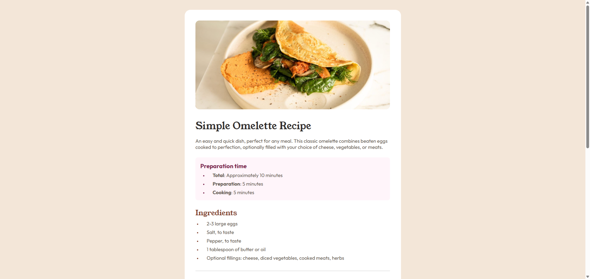
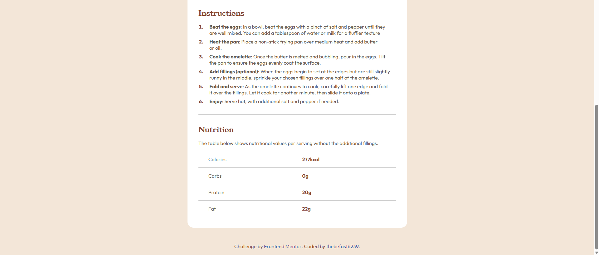

# Frontend Mentor - Recipe page solution

This is a solution to the [Recipe page challenge on Frontend Mentor](https://www.frontendmentor.io/challenges/recipe-page-KiTsR8QQKm). Frontend Mentor challenges help you improve your coding skills by building realistic projects. 

## Table of contents

- [Overview](#overview)
  - [Screenshot](#screenshot)
  - [Links](#links)
- [My process](#my-process)
  - [Built with](#built-with)
  - [What I learned](#what-i-learned)
- [Author](#author)

## Overview

### Screenshot




### Links

- Solution URL: [Add solution URL here](https://github.com/thebefast6239/recipe-page-main)
- Live Site URL: [Add live site URL here](https://thebefast6239.github.io/recipe-page-main)

## My process

### Built with

- Semantic HTML5 markup
- CSS custom properties
- Flexbox
- Mobile-first workflow

### What I learned

I used @media again for "Mobile-first" workflow;
Used root: in css;
Used rem instead of px;

Interesting properties (::marker)
```css
.preparation-time-ul li::marker{
    font-size: 0.8rem;
    color: var(--rose-800)
}
```

Made a cool effect in footer
```css
.attribution {
   user-select: none; 
}

.attribution a{
    display: inline-block;
    color: #3e52a3;
    transition: font-size 0.25s ease, color 0.25s ease;
}

.attribution a:hover{
    color: var(--rose-800);
    font-size: 1.1rem;
    cursor: pointer;
}
```

## Author

- Website - [thebefast6239](https://github.com/thebefast6239)
- Discord - [a0s9d8f7g6h5j4k3l2](https://discord.gg)